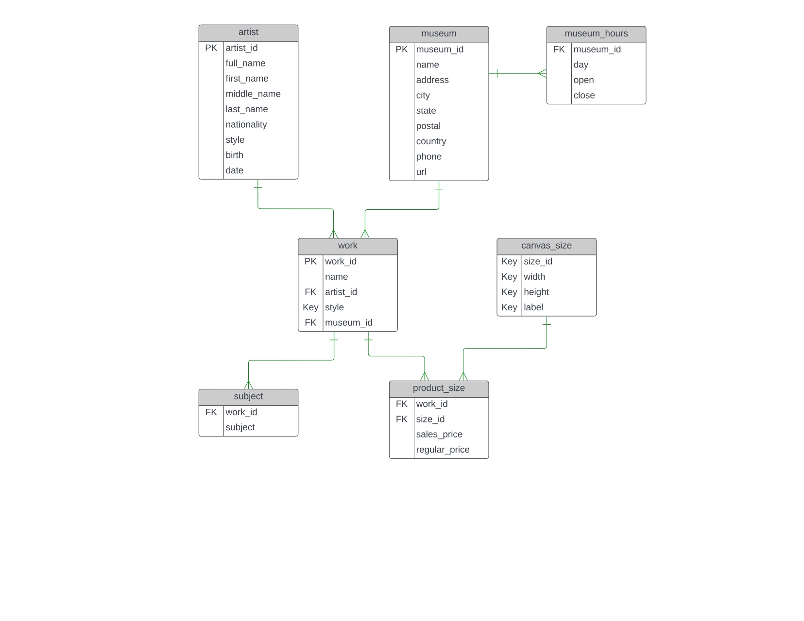

# SQL Dataset Project

This repository contains SQL queries and solutions for analyzing a dataset on paintings. The dataset was downloaded from Kaggle, and it includes information about various aspects of paintings, including artists, subjects, sizes, museums, and more.

## Project Overview

In this project, I have utilized SQL queries to explore and analyze the painting dataset. The queries cover a range of questions, including basic data exploration, filtering, aggregation, and more complex analysis.

## Dataset Information

- **Source:** Kaggle
- Dataset Name: Famous Paintings =  [Painting Dataset](https://www.kaggle.com/datasets/mexwell/famous-paintings)
- Youtube video:                 = https://www.youtube.com/watch?v=AZ29DXaJ1Ts&t=1296s
- **Description:** The dataset consists of 7 tables: `work`, `subject`, `product_size`, `artist`, `canvas_size`, `museum`, and `museum_hours`. Each table contains specific information related to paintings, artists, sizes, museums, etc. 

## SQL Table Diagram

Below is the diagram illustrating the relationships between the tables:

## Queries

I have solved a total of 14 queries on the painting dataset. These queries cover various aspects of data exploration and analysis. Questions and queries are present in separate file.

